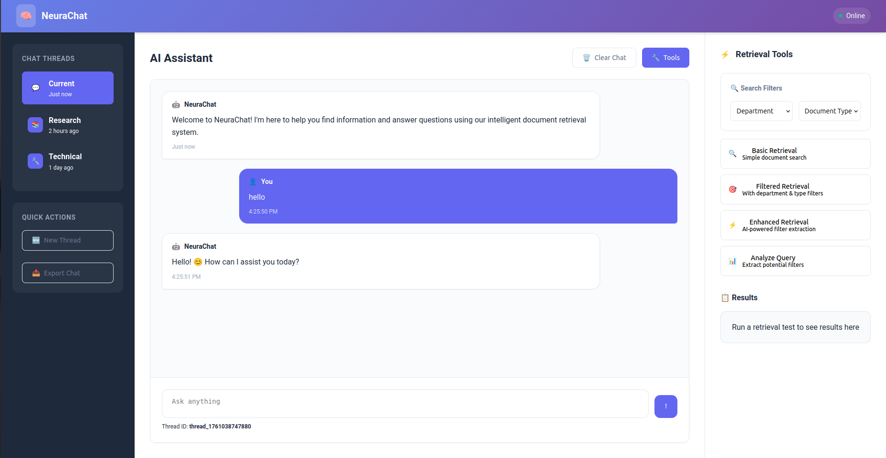

# 🤖 NeuraChat - AI Assistant

[](https://python.org)
[](https://fastapi.tiangolo.com)
[](https://render.com)
[](LICENSE)

A sophisticated AI-powered chatbot with advanced document retrieval capabilities using Qdrant vector search and Mistral AI.



## ✨ Features

### 🧠 Intelligent AI Assistant
- **Mistral AI Integration** - Powered by state-of-the-art language models
- **Context-Aware Conversations** - Maintains conversation history and context
- **Multi-thread Support** - Separate conversation threads for different topics

### 🔍 Advanced Document Retrieval
- **Qdrant Vector Search** - Lightning-fast semantic search
- **Smart Filtering** - Filter by department, document type, and year
- **Automatic Filter Extraction** - AI-powered metadata extraction from queries
- **Cached Retrieval** - Optimized performance with intelligent caching

### 🎨 Professional Interface
- **Modern Web UI** - Clean, responsive design with real-time updates
- **Real-time Streaming** - Live response streaming for better UX
- **Thread Management** - Organized conversation management
- **Comprehensive Testing Tools** - Built-in retrieval testing interface

## 🚀 Quick Start

### Prerequisites
- Python 3.10+
- Qdrant Cloud account
- Mistral AI API key

### Installation

1. **Clone the repository**
```
git clone https://github.com/trongkhanh083/chatbot-api.git
cd chatbot-api
```

2. **Install dependencies**

```
pip install -r requirements.txt
```

3. **Set up environment variables**
   
Edit .env with your credentials:

```
MISTRAL_API_KEY=your_mistral_api_key
QDRANT_URL=your_qdrant_cloud_url
QDRANT_API_KEY=your_qdrant_api_key
QDRANT_COLLECTION_NAME=your_qdrant_collection_name
```

4. **Generate or use your own documents**

```
python -m config.data_generation
```

5. **Upload documents to Qdrant**

```
python -m config.upload_to_qdrant
```

6. **Run the application**

```
python main.py
```

## 🙏 Acknowledgments
- Mistral AI for powerful language models
- Qdrant for excellent vector search capabilities
- FastAPI for the modern Python web framework
- LangChain for the AI framework

<div align="left"> Built with ❤️ using FastAPI, Mistral AI, and Qdrant </div>